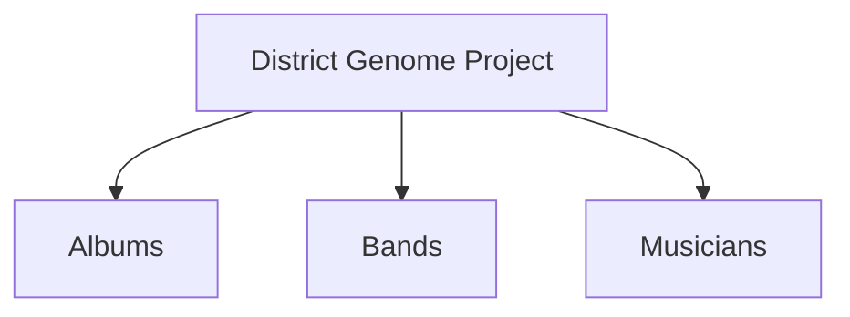

## Welcome to the Disctrict Genome Project
Our mission is to build an interactive OSINT map connecting the punk bands we know and love. As a result of the spread of the members of the short-lived but prolific Slapstick, we have started with the Slapstick family tree and are tracing those branches to see how far we can go.

For example, how many hops from Slapstick to The Aquabats? Well, offhand, it appears to be Slapstick to Alkaline Trio to Blink-182 to The Aquabats. Could there be fewer degrees of separation? Hopefully we will learn!
